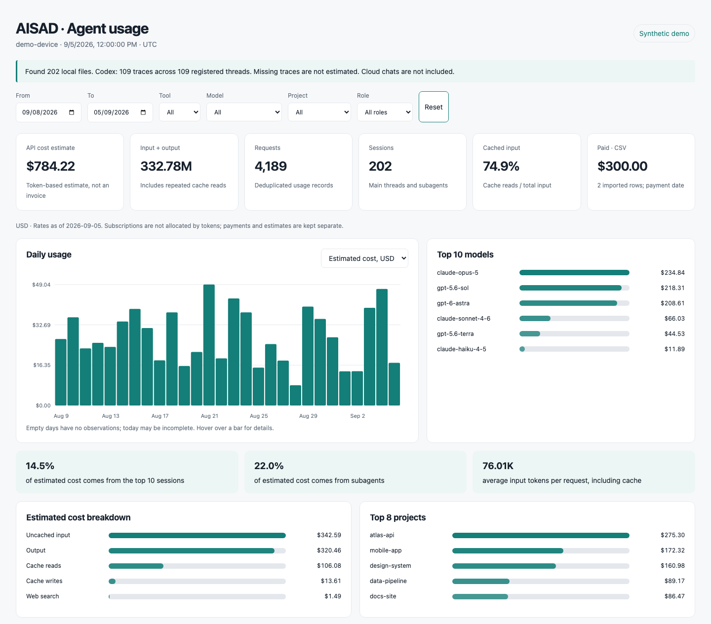

# AISAD — AI Session Analysis Dashboard

A portable, local-only dashboard for Claude Code and Codex usage. Track tokens, cache usage and estimated API costs by model, project, day and session.

**Python 3.9+, standard library only.** No API keys, accounts, pip packages, Node.js or Codex plugins required. Collection and reporting happen on your device. The script makes no outbound network requests; watch mode serves the dashboard on `127.0.0.1`.



*Example dashboard with synthetic sessions. The screenshot contains no personal usage data.*

## Quick start

Clone into a writable directory and start collecting:

```sh
git clone https://github.com/aiatsuk/aisad.git
cd aisad
python3 agent_usage.py --watch 60 --open
```

The dashboard opens in your browser and checks for local changes every minute. An available port is selected automatically. Press `Ctrl+C` to stop.

On macOS, you can also open `Run.command` from the repository folder. On Windows, use `py -3` instead of `python3`. If needed, install Python 3.9+ from [python.org](https://www.python.org/downloads/).

For a one-time snapshot without a running server:

```sh
python3 agent_usage.py --open
```

The generated HTML works offline. You can also copy just `agent_usage.py` to another device: the dashboard and price catalog are embedded in this one file.

Watch mode runs while its process is open. It does not install a system service or configure startup. Restart it after a reboot. If a refresh fails, the previous HTML stays available and the process retries on the next interval. To update the code, run `git pull --ff-only`, then restart the script.

## What you can explore

- Tokens and estimated cost by model, day, project and session.
- Uncached input, output, cache reads and 5-minute/1-hour cache writes.
- Main threads, subagents and auto-review where roles are recorded.
- Global date, tool, model, project and role filters; a searchable session table.
- Cost concentration, subagent share and average input per request.
- Trace coverage, parsing diagnostics and requests with unknown prices.
- Actual payments imported separately from a local billing CSV.

Session titles are excluded by default; the dashboard uses session IDs and project names. `--include-titles` adds shortened titles with basic redaction of obvious secrets. This is not comprehensive anonymization. Message bodies, reasoning, tool arguments and tool results are not saved in the export.

## Estimated cost versus actual payments

**Local token counts cannot reveal subscription charges, remaining account limits or a provider invoice.** Even Claude SDK `total_cost_usd` is an estimate. AISAD does not add it to request-level costs because it may already include subagents and cumulative totals across turns.

Built-in rates calculate an **API-equivalent estimate** from each model's input, output, cache usage and available processing mode/geography. The catalog was checked on **September 5, 2026**. It is a current-rate scenario applied to the available history, not a reconstructed billing history.

Missing tiers default to Standard and missing geography defaults to global. An unknown model or unsupported mode has a missing price, not a zero price; the total is marked partial. If a Claude cache-write TTL is unknown, cost is shown as a 5-minute to 1-hour range.

To show actual payments, prepare a local file using [billing-template.csv](billing-template.csv):

```sh
python3 agent_usage.py --billing billing.csv --open
```

| Field | Meaning |
| --- | --- |
| `transaction_id` | Unique payment or charge row ID; duplicates are rejected |
| `date` | Accounting date, `YYYY-MM-DD` |
| `provider` | `Codex`/`OpenAI` or `Claude`/`Anthropic` |
| `amount_usd` | Confirmed amount in USD; a negative value represents a refund |
| `model` | Optional model attribution from your billing records |
| `project` | Optional project attribution from your billing records |

There is no currency conversion or verification of payment authenticity. Use exact rows from your statement or export, then reconcile the import against its source. Rows without a model or project remain `unallocated`; costs are not allocated by token share. The role filter does not affect payments. Subscription payments and API estimates must not be added together as one expense.

## Local pricing overrides

Create and edit a local price catalog:

```sh
python3 agent_usage.py --write-prices prices.json
python3 agent_usage.py --prices prices.json --open
```

`models` maps model IDs to `input`, `cached`, `write_5m`, `write_1h` and `output` rates in USD per million tokens. To describe historical prices, replace a model's rate object with a list of objects using `valid_from` (inclusive) and `valid_to` (exclusive). Zero or multiple matching rules leave the price unknown.

Supported adjustments include `long_threshold`, `long_input_multiplier`, `long_output_multiplier`, `long_scope` (`session`, or per request by default), `fast_multiplier`, `flex_multiplier` and `batch_multiplier`. `as_of` records when the catalog was checked. Rates are never downloaded or updated automatically.

Explicitly recorded server-side web searches are included at $0.01 per search. Other service fees, discounts, taxes and missing telemetry are not reconstructed. Output counts come from traces, which can contain intermediate SDK values; estimates reflect only the recorded observations.

Sources: [OpenAI pricing](https://developers.openai.com/api/docs/pricing), [Claude pricing](https://platform.claude.com/docs/en/about-claude/pricing), [Claude SDK cost tracking](https://code.claude.com/docs/en/agent-sdk/cost-tracking).

## Local data sources

- **Codex:** `$CODEX_HOME` or `~/.codex`; `sessions`, `archived_sessions` and the newest readable `state_*.sqlite` registry.
- **Claude Code:** `$CLAUDE_CONFIG_DIR` or `~/.claude`; `projects`, including nested `subagents`.
- **Optional `--cowork`:** local Claude Cowork audit traces under macOS Application Support.

Override the directories when needed:

```sh
python3 agent_usage.py --codex-dir '/local/path/Codex' --claude-dir '/local/path/Claude' --output '/local/path/Report'
```

`--home '/path/to/profile'` selects another local profile. In this mode, `CODEX_HOME` and `CLAUDE_CONFIG_DIR` are ignored unless explicit source directories are supplied. The timezone defaults to the system setting. Use `--timezone Europe/Amsterdam` to override it; this requires an installed IANA timezone database, available on standard macOS systems.

Source SQLite databases are opened read-only. The parser handles incomplete final JSONL records, cumulative counter resets and missing directories. Changed files are reread; unchanged files use a local cache. Removed source files disappear from subsequent snapshots and are removed from the cache. Duplicate messages across files are counted once; copied Claude requests are assigned to the first main trace in a stable order.

## Output and privacy

`output/` contains:

| File | Purpose |
| --- | --- |
| `dashboard.html` | Self-contained offline dashboard |
| `usage.json` | Normalized usage evidence and local source metadata |
| `parse-cache.sqlite` | Local cache of parsed files |
| `prices-used.json` | Price catalog used for the snapshot |
| `status.json` | Snapshot timestamp for automatic refresh |

The local server exposes only the dashboard and its update timestamp. Raw exports and the parse cache are not served.

**Clone the code on each device; keep its reports local.** Default output, JSONL traces, databases, local CSV files and price overrides are excluded through `.gitignore`. If you use a custom `--output` directory, place it outside the repository or add it to your local Git exclusions. Reports still contain session and project metadata; publishing them is not required to use AISAD.

`refresh.py` is an alternative entry point with the same behavior.

## Tests and demo

```sh
python3 -m unittest -v test_agent_usage.py
```

Tests use synthetic profiles only. They cover deduplication, counter resets, pricing, cache TTLs, unknown models, CSV billing, empty profiles, file changes and deletion, paths with spaces, safe HTML embedding and loopback refresh. GitHub Actions runs the suite on macOS, Linux and Windows without collecting any personal history.

To generate the example dashboard without reading your sessions:

```sh
python3 scripts/make_demo.py
```

Open `output/demo/dashboard.html` in a browser. The demo is deterministic and uses synthetic sessions and payments. The README screenshot was captured from this page. Playwright is needed only if you choose to recreate the screenshot with `scripts/capture_demo.cjs`; it is not a dashboard dependency.

## Background and limits

Inspired by the usage monitoring and session analysis discussion, including figures 11–12, in [Uber: The Efficient Software Factory](https://www.uber.com/by/en/blog/efficient-software-factory/). AISAD measures recorded local usage; token counts do not establish productivity, output quality or time saved.

Supported sources are local **Claude Code and Codex** traces, not all cloud conversations in Claude.ai or ChatGPT. Deleted or unsaved sessions cannot be recovered. Log format changes may require parser updates; diagnostics expose missing data and unknown models.
