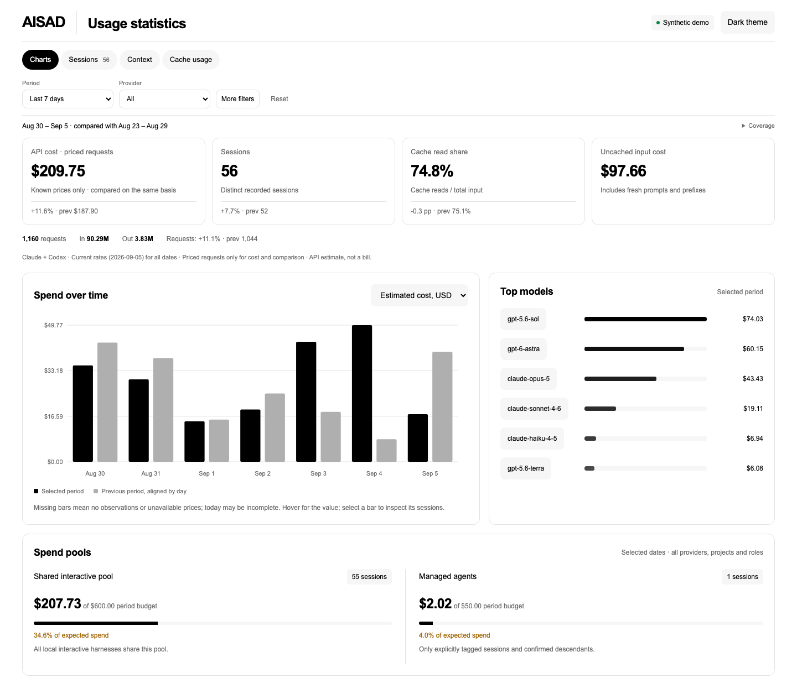

# AISAD — AI Session Analysis Dashboard

An independent, on-demand analyzer of local Claude Code and Codex session files. Collect usage and event metadata, inspect sessions, and build an offline dashboard. Commands run on demand; the terminal dashboard waits for keyboard input and exits with Q/Escape. The optional skill invokes the same standalone commands.

**Python collector: 3.9+, standard library only.** No API keys, accounts, pip packages, Node.js or Codex plugins required. The optional enhanced terminal UI uses a bundled TypeScript/React/Ink module when Bun is installed; Python-only operation remains available. Collection and reporting happen on your device. Every command that reads your sessions opens no network connections or listening sockets; the single exception is `prices --refresh`, which reads published rates and sends nothing about your usage. It installs no MCP servers, hooks, telemetry exporters, app-server observers or background services. The optional skill checks GitHub for code updates without sending usage data, and supports offline use.



*Example dashboard with synthetic sessions. The screenshot contains no personal usage data.*

For the exact token formulas, cache-rate definition, pricing assumptions and comparisons with ccusage and Token Use, see [Usage accounting](docs/ACCOUNTING.md).

## Quick start

Clone into a writable directory and build a snapshot:

```sh
git clone https://github.com/aiatsuk/aisad.git
cd aisad
python3 agent_usage.py dashboard --open
```

The command reads existing local files, updates `output/sessions.sqlite`, writes a self-contained HTML file, opens it and exits. Rerun the command when you want fresh data. Opening or interacting with the dashboard does not collect anything.

On macOS, `Run.command` performs the same one-shot action. On Windows, use `py -3` instead of `python3`. Python 3.9+ and its standard library are sufficient; the collector remains a single portable file.

To update a clone, run `git pull --ff-only`. Existing snapshots remain usable offline.

## Quick usage without a dashboard

```sh
python3 agent_usage.py usage
```

Example output:

```text
For Aug 30–Sep 5: $1,327.32 estimated API cost. In: 29M, Out: 1.28M
```

The command reads local traces, reuses the parse cache, prints the last seven days, and includes a comparison with the previous seven days when records exist. It generates no HTML, opens no browser and starts no server. These example numbers are illustrative; your report uses this device's actual recorded usage.

`In` is total input tokens, including cache reads and writes; `Out` is output tokens. Counts use K/M/B/T with up to two decimal places. The comparison covers estimated cost, input and output. JSON retains exact token counts, requests and sessions for detailed analysis.

Use JSON for scripts and agent analysis:

```sh
python3 agent_usage.py usage --json
python3 agent_usage.py usage --json --provider claude --days 30
python3 agent_usage.py usage --json --from 2026-08-30 --to 2026-09-05 --model gpt-6-astra
python3 agent_usage.py usage --json --all-time --include-requests
```

`--provider` accepts Codex/OpenAI or Claude/Anthropic, case-insensitively. `--model`, `--project` and `--role main|subagent|review` filter both periods. `--from` and `--to` are inclusive report-timezone dates. `--days` defaults to 7; `--to` can anchor a historical window. `--all-time` includes all observed dates with no comparison. Existing source, pricing, timezone and output options work with `usage` too.

`--json` writes one JSON object to stdout. Every usage run also saves `output/usage-report.json`. A usage answer needs only usage observations, so `usage`, `analyze` and `statusline` skip the event timeline entirely: they neither publish `output/sessions.sqlite` nor rewrite `output/usage.json`, which keeps a report to seconds on a multi-gigabyte history. `collect`, `sessions`, `session`, `dashboard` and `--include-events` publish both.

| JSON field | Contents |
| --- | --- |
| `schema_version`, `version` | Report schema and AISAD release versions |
| `period`, `previous_period`, `filters`, `timezone` | Exact scope of the report |
| `current.totals`, `previous.totals` | Requests, distinct sessions, tokens, weighted cache share, pricing coverage and cost components |
| `current.by_provider`, `by_model`, `by_project`, `by_role`, `by_session`, `by_date` | Breakdowns; also present under `previous` |
| `current.rows`, `previous.rows` | Joint date/provider/model/session/project/role groups for custom analysis |
| `current.requests`, `previous.requests` | Optional normalized request records with `--include-requests`; no transcripts |
| `changes` | Comparison status and deltas; missing data and uncertain prices remain explicit |
| `quality`, `scan`, `source_summary` | Collection diagnostics over all discovered history, not just the filtered period |
| `price_as_of`, `price_sources`, `unknown_models` | Price provenance and unpriced models in the current filtered period |
| `current.telemetry`, `previous.telemetry` | Trace coverage and measured tool/MCP counts and sizes |
| `current.request_stats`, `previous.request_stats` | Per-request context, timing and numeric trace statistics with `--include-requests` |
| `pools`, `pool_scope` | Shared interactive and managed spend across all providers/projects for the selected dates |

`estimated_cost_usd` and `estimated_cost_high_usd` are null when no requests can be priced. With partial pricing they contain the known subtotal; check `unpriced_requests` before interpreting them as a complete total. `known_cost_usd` always names that known subtotal explicitly. `uncached_input_tokens + cached_input_tokens + cache_write_tokens` equals `input_tokens`. `cost_parts_usd` and `cost_parts_high_usd` give the lower and upper priced subtotals for each component. A nonzero range reflects unknown cache TTLs. `cache_share` is a fraction; its delta uses percentage points. Session counts are distinct within each group, so adding sessions across models or dates double-counts shared sessions. Missing dates are absent from the breakdown, not proof of zero usage.

## Session statistics

Use `usage --json --include-requests` to inspect request timing, input/output tokens, cache usage, and numeric tool/MCP counts and sizes. These records support questions such as “Which sessions had the largest tool payloads?” or “How did cache usage change this week?” Tool bytes are measured locally and are not converted into billed tokens. Missing tool telemetry is reported explicitly.

`analyze` remains an alias for `usage`, including JSON and filters. It returns statistics only. AISAD does not generate recommendations, flag workflow patterns, or estimate hypothetical savings.

Usage and status-line JSON now use `schema_version: 2`. Usage reports replace `diagnostics` with `telemetry` and `analysis_records` with `request_stats`; `analysis_rules` is removed. Status-line reports omit coaching fields. Token and cost totals, breakdowns, periods and comparisons keep their existing field names. The full `usage.json` snapshot exposes numeric request statistics in `request_stats`.

## Collect and inspect session evidence

```sh
python3 agent_usage.py collect --json
python3 agent_usage.py sessions --json
python3 agent_usage.py session --session Codex:SESSION_ID --json
python3 agent_usage.py session --session Claude:SESSION_ID --tree --all-time --json
python3 agent_usage.py session --session Codex:SESSION_ID --json --offset 200 --limit 200
python3 agent_usage.py usage --json --include-requests --include-events
```

Each command gathers existing files when invoked. `collect` returns a database summary. `sessions` and `session` return date-scoped own/tree costs, tool statistics and a paginated event timeline. They share usage's date, provider, model, project, role and pool options. Seven days is the default; use `--all-time` for the complete observed history. `--tree` includes confirmed descendants. Timeline pages default to 200 events and support up to 10,000; follow `next_offset` until it is null. Events without timestamps remain in SQLite but cannot be placed in a date-filtered report; `undated_events` reports their count for the selected sessions. Tool result sizes remain unknown when payloads are absent; `results_without_size` identifies this coverage gap.

`own` counts a session's observations; `tree` includes its confirmed descendants once. Tree totals overlap and must not be added together. Lifecycle and explicitly named `lifetime` fields use all observed history. A completed turn is not proof that a session is currently completed: state stays `unknown`, with `last_seen` and the last recorded lifecycle event. Elapsed time includes idle periods; active time remains unavailable.

The dashboard contains Charts, Sessions, Context and Cache usage. Select a daily bar, model or project to narrow the session list. Open a session and select a point on its input chart to inspect the usage record and source references. The offline HTML contains at most the latest 200 metadata events per session; use the CLI or SQLite for complete history. Recommendations and hypothetical savings remain disabled.

### Local event database

`sessions.sqlite` contains `source_files`, `sessions`, `turns`, `events`, `event_sources`, `usage_observations`, `observation_events`, `tool_calls`, `context_snapshots` and `metadata`. Event schema version 1 is stored in `PRAGMA user_version`. Existing usage JSON remains schema version 2 with additive evidence fields.

A collection updates the database in place: `source_files` records each trace's size and mtime, and only the sessions whose traces moved are rewritten, inside one transaction. `metadata.build_signature` covers the collector version, parser and price catalog, so changing any of them rebuilds every row rather than leaving stale costs behind.

For example, open the database read-only from Python:

```python
import sqlite3
from pathlib import Path

path = Path('output/sessions.sqlite').resolve()
connection = sqlite3.connect(path.as_uri() + '?mode=ro', uri=True)
try:
    print(connection.execute('SELECT model, SUM(input_tokens), SUM(estimated_cost_usd) FROM usage_observations GROUP BY model').fetchall())
finally:
    connection.close()
```

`event_sources` provides the source-file ID, line, byte offset and parsed-record SHA-256 fingerprint. Resolve paths through `source_files`. The fingerprint is SHA-256 of AISAD's canonical JSON representation (`evidence_id(raw_record)`), not a hash of the raw line bytes. Request records link to events through `observation_events`; `request_stats.evidence` exposes those references in JSON and HTML. The selected price catalog is saved in database metadata and `prices-used.json`.

The database is a derived snapshot, rebuilt transactionally from discovered sources and the parse cache. Repeated collection does not add usage. Copied records are deduplicated; removed source files disappear from the next snapshot. An interrupted database transaction preserves its previous complete state. Files can continue growing while they are read: each read stops at its initial size, tolerates an incomplete final line, and reports collection issues in `quality`. Different files are not an atomic snapshot of the running applications.

Only allowlisted metadata is retained. Prompts, replies, reasoning, tool arguments, result bodies and compaction summaries are not copied. There is no transcript-recording mode. Source references let you inspect originals locally while they still exist; they do not preserve deleted conversation content.

### Measurement limits

Usage and session JSON expose `measurement_basis`: tokens and logged result bytes are measured; API cost is estimated; active time, exact context composition, loaded tool definitions, repeated tool-result input and invoices are unavailable. Logged result size does not establish how much reached a model or remained after compaction. Cache reads still consume context. The most recent request's input is a historical observation, not live context utilization.

### Migration from monitoring modes

`--watch` and `--stdin` are rejected before collecting. No dashboard server or browser polling remains. `statusline` is retained only as a manually invoked one-shot text/JSON snapshot. If you previously configured an external status hook or scheduler, remove that configuration yourself; AISAD does not edit other tools' settings.

## Status line

```sh
python3 agent_usage.py statusline
python3 agent_usage.py statusline --monthly-budget 3000 --color
python3 agent_usage.py statusline --json
```

AISAD prints one compact line; Claude Code's own mode indicator can appear beneath it:

```text
td $11.45 · wk $647.75 vs $353.64 (+83%) · mo $950.02 vs $1,156.65 (-18%) [██▊░░░] 47.5%
```

The line shows today's estimate first, then calendar-week-to-date spend (Monday through today) versus the same weekdays in the previous week, followed by monthly spend and comparison, and the compact monthly-budget bar. For example, Monday–Thursday compares with Monday–Thursday one week earlier. Both weekly windows and today's estimate include all discovered Claude/Codex sessions and agent pools, independent of report filters. A cost delta appears only when both windows have comparable priced observations. Monetary amounts omit `+`; positive comparison deltas retain it. Incomplete-pricing metadata remains in JSON; no records show `unavailable`, and wholly unpriced observations show `unpriced`.

The budget remains **calendar-month-to-date** against a **$2,000 default monthly limit**, across all discovered sessions and agent pools. `--monthly-budget USD` overrides the saved limit for this run. The month follows `--timezone` (system local timezone by default) and resets on the first day. Existing `--budget` and `--managed-budget` remain separate selected-period pool budgets in JSON and the dashboard.

The `mo` block shows monthly spend followed by the previous-month subtotal and delta; the bar and budget percentage come last. They use equal day windows from the start of each month. If the previous month is shorter, an explicit `28d CURRENT vs PREVIOUS` (or `29d`/`30d`) shows both comparison subtotals, while the amount before the bar still covers the complete current month to date.

The bar is six terminal cells wide, with eighth-cell precision, a dark gray background and a percentage beside it. Its fill is warm coral below 65%, amber from 65%, orange from 80% and red from 100%. The fill caps at the limit while the percentage continues to show overspend. Budget percentages omit `+`; JSON retains pricing coverage. Terminal output enables colors automatically; `--color` forces ANSI colors in piped output, and `--no-color` disables them. `NO_COLOR` and `TERM=dumb` disable automatic colors. Both colored and plain output bracket the bar and use shaded unused cells, with one space between each block.

`statusline --json` retains the session, harness, pool and selected-period summary fields and exposes `weekly` and `monthly_budget`. Monthly comparison metadata remains available in `monthly_budget.comparison`: equal day windows from the beginning of each month, capped to the last common day if the previous month is shorter, while the budget includes every current-month day through today. Missing history is unavailable rather than assumed zero; costs are API-equivalent estimates, not subscription billing or enforced caps. The command prints one snapshot and exits.

## Terminal dashboard and saved budget

```sh
aisad chart --offline --color
aisad chart --offline --color --interactive
aisad chart --offline --color --snapshot
aisad chart --offline --color --view weeks --month 2026-09 --snapshot
aisad chart --offline --json
aisad budget
aisad budget --set 3000
aisad budget --reset
```

`chart` opens a keyboard-driven view when both input and output are a terminal, or prints one snapshot when piped or given `--snapshot`: days 01 through the last day of the selected calendar month (current by default) on the horizontal axis, daily USD cost on the vertical axis with automatic rounded steps. Every day has a number and a two-letter weekday beneath it; weekends are highlighted. Narrow terminals split the month into panels to keep the labels legible. Claude, Codex and other observed providers have separate colored step lines with rounded corners and a compact legend; use `--color` to force colors, `--no-color` to disable them, or `--ascii` for plain ASCII line drawing. It fits the terminal width (48–240 columns) and supports a 4–30-row maximum height. Dates follow `--timezone`, and future dates remain blank. Use `--month YYYY-MM` for another calendar month; custom date ranges belong to `usage`.

The enhanced terminal view uses strict TypeScript, React and public upstream Ink, built into one module with Bun. Ink manages layout through Yoga, key handling, live terminal resize and alternate-screen cleanup. Python still collects and prices usage; the UI receives only monthly numeric aggregates, never transcript text, source paths or project names. Navigation reuses those aggregates and does not open network connections or rescan sessions.

When the bundled UI and Bun are available, `aisad chart` selects it automatically. Otherwise the portable Python view remains available. Set `AISAD_TERMINAL_UI=python` to select that view explicitly. Snapshot and JSON commands continue to use Python without launching the UI. The enhanced UI browses loaded months, from the earliest available history/requested month through the current month.

For UI development and a local bundle:

```sh
cd ui
bun install --frozen-lockfile --ignore-scripts
bun run check
bun run test
bun run build
cd ..
python3 scripts/build_release.py --tag v1.2.0 --with-ui
```

The UI bundle includes its dependencies and third-party notices; no package installation is needed at runtime. Packaging checks source fingerprints and refuses a stale UI build. Omitting `--with-ui` builds the existing portable Python package.

In the terminal, press **W** to switch between the graph and a weekday table, **H** for the previous month, **L** for the next month (up to the current month), and **Q** or Escape to exit. Left/right arrow keys also change months. `--interactive` requires a terminal; `--view weeks --snapshot` prints the table without waiting for keys. Navigation reuses the initial local snapshot; it does not poll, rescan, start a server or reach the network. Exiting restores the terminal.

The Ink UI uses brief particle morphs when changing months or views: chart lines move within the plot area and a compact navigation badge changes shape. Exact costs, axes and table cells stay ordinary text. Animation stops at rest; rapid input retargets from the current positions. Set `AISAD_REDUCED_MOTION=1` to disable movement. Screen readers, CI, ASCII, no-color output and the Python fallback stay static. Narrow/multi-panel graphs switch directly while the navigation badge provides the transition. Resizing settles graph geometry immediately; the normalized badge continues without restarting.

The weekday table has seven rows, Sunday through Saturday, and a column per Sunday–Saturday calendar week. Each cell shows only that day's known USD subtotal. Partial first/last weeks keep dates outside the month blank; unknown/future days show `—`, wholly unpriced days show `?`, and observed zero spend shows `$0.00`. Daily cells use five equal spend bands relative to the month's largest known daily subtotal: primary text, muted warm, coral, orange and amber; the highest band is bold. A final Total row shows each column's known weekly subtotal, keeping empty/unpriced columns distinct from observed zero. Below the table, Python generates a deterministic Insights summary with a budget forecast and the highest average spending weekdays over the last four completed weeks. Default cells combine Claude/Codex API estimates; Grok remains separate. With `--provider grok`, cells show Grok's reported cost. `chart --json` includes the same matrix in `weekday_view`.

Run the command in the terminal to see the actual colored chart; an ASCII reconstruction in an assistant message is not a faithful preview. `--ascii` is an explicit compatibility fallback. Only recorded daily observations are plotted. Gaps remain gaps, wholly unpriced days show `?`, and overlapping series keep the visible provider's color. Incomplete pricing/coverage remains explicit in the footer and JSON. Claude/Codex costs are API-equivalent estimates; Grok, when available, uses its provider-reported completed-turn cost and is labelled `reported`. The shared budget continues to cover Claude/Codex; Grok reported costs stay separate. Other providers appear when supported local observations exist. `chart --json` also saves `output/chart.json` with exact daily values and coverage.

`budget` reads the saved monthly limit without collecting sessions or reaching the network. `budget --set USD` atomically saves a finite positive amount, and `--reset` restores $2,000. The setting lives in `output/budget.json` under the selected data directory, outside the replaceable skill. Codex and Claude helpers share it by default. Statusline and the terminal chart use the saved limit; `--monthly-budget USD` overrides it for a single run. The existing local Claude statusline also honors the saved setting, unless `AISAD_MONTHLY_BUDGET` explicitly overrides it.

To add the `aisad` terminal command when installing a local bundle, use `--cli-dir` pointing to a directory already on your PATH:

```sh
python3 skills/aisad/scripts/aisad.py install --target both \
  --archive dist/aisad-skill-v1.2.0.zip --checksum-file dist/SHA256SUMS \
  --cli-dir "$HOME/.local/bin"
```

This installs a small launcher without editing shell settings and refuses to overwrite an unrelated existing command. Without it, invoke the installed helper with Python and the same commands. The existing offline HTML dashboard remains available through `aisad run --offline -- --open`.

## Install the skill

From a clone of this repository:

```sh
python3 skills/aisad/scripts/aisad.py install --target codex
```

Use `--target claude` for Claude Code or `--target both` for both applications. Defaults are `~/.codex/skills/aisad` and `~/.claude/skills/aisad`, honoring `CODEX_HOME` and `CLAUDE_CONFIG_DIR`. Use `--dest '/path/to/skills'` for a custom skills parent directory, or `--version 1.0.7` to install that published release. The package includes its own collector; you do not need to keep the clone afterward.

You can also ask Codex's skill installer to install `skills/aisad` from `aiatsuk/aisad`. A raw GitHub skill installation downloads its bundled runtime on first use. A release installation already includes the runtime and works offline immediately.

In a new turn, invoke `$aisad usage` in Codex or `/aisad usage` in Claude Code. Ask follow-up questions such as:

- “Which models cost the most this week?”
- “Compare Claude and Codex with the previous week.”
- “Which sessions explain the increase in estimated cost?”
- “Show cache usage for this project over the last 30 days.”
- “Show the largest recorded context and tool payloads by session.”
- “Inspect this session’s recorded events and tool calls.”

The skill collects JSON and computes answers locally. It uses the text command for a quick summary and opens the dashboard when requested. Its instructions are in [skills/aisad/SKILL.md](skills/aisad/SKILL.md).

For this unreleased source version, build and install the local bundle without contacting GitHub:

```sh
python3 scripts/build_release.py --tag v1.1.0
python3 skills/aisad/scripts/aisad.py install --archive dist/aisad-skill-v1.1.0.zip --checksum-file dist/SHA256SUMS --target codex
```

### Updates and offline use

The installed helper supports:

```sh
python3 ~/.codex/skills/aisad/scripts/aisad.py version
python3 ~/.codex/skills/aisad/scripts/aisad.py check-update
python3 ~/.codex/skills/aisad/scripts/aisad.py update
python3 ~/.codex/skills/aisad/scripts/aisad.py usage --json
python3 ~/.codex/skills/aisad/scripts/aisad.py usage --offline
python3 ~/.codex/skills/aisad/scripts/aisad.py analyze --json
python3 ~/.codex/skills/aisad/scripts/aisad.py sessions --offline --json
python3 ~/.codex/skills/aisad/scripts/aisad.py run -- --open
```

Substitute your installed skill directory if it differs. `usage`, `analyze`, `statusline` and `run` check for a newer stable release at most once every 24 hours when invoked. They update the skill, launcher and collector together before running. Update messages go to stderr, keeping JSON stdout clean. `check-update` checks immediately without replacing code; `update` applies a newer release immediately. Existing HTML files remain fixed until another dashboard command generates a new snapshot.

Checks and downloads contact only the public GitHub repository for release metadata and code. They transmit no traces, metrics or device identifiers. `--offline` skips those requests. Set `AISAD_AUTO_UPDATE=0` to disable automatic checks persistently in your environment; explicit `check-update` and `update` still work. If an automatic check fails, the installed version remains usable. No scheduler or startup service is installed.

Skill reports default to `~/.local/share/aisad/output`, outside the replaceable installation. `AISAD_DATA_DIR` or the helper's `--data-dir` selects another local data directory. Collector arguments can follow `--`; keep custom outputs outside the skill directory. Updates verify SHA-256 checksums and the package manifest, preserve local modifications by refusing to overwrite them, and restore the previous installation if replacement fails.

For offline installation, download the skill ZIP and `SHA256SUMS` from a [release](https://github.com/aiatsuk/aisad/releases), then use a local copy of the helper:

```sh
python3 skills/aisad/scripts/aisad.py install \
  --archive aisad-skill-v1.0.7.zip --checksum-file SHA256SUMS --target codex
```

## What you can explore

- The last seven days by default, compared with the preceding seven days when records exist.
- Provider totals for OpenAI/Codex and Anthropic/Claude; click a provider to filter the dashboard.
- Tokens and estimated cost by model, day, project and session.
- Uncached input, output, cache reads and 5-minute/1-hour cache writes.
- Main threads, subagents and auto-review where roles are recorded.
- Global period, date, provider, model, project, role and pool filters; a searchable, sortable session table with request timelines.
- Context and tool footprints, cache usage, and a token/cost breakdown for uncached input, cache reads, cache writes and output.
- Trace coverage, parsing diagnostics and requests with unknown prices.

Session titles are excluded by default; the dashboard uses session IDs and project names. `--include-titles` adds shortened titles with basic redaction of obvious secrets. This is not comprehensive anonymization. Message bodies, reasoning, tool arguments and tool results are not saved in the export.

## Periods and comparisons

The default **Last 7 days** includes the snapshot date and the six preceding calendar days, using the report's timezone. For example, a September 5 snapshot shows August 30–September 5 against August 23–29. An old trace does not move the window backward. The window advances when you next run the collector.

Choose **This week (Mon–today)** for the current calendar week so far, compared with the same weekdays last week. **Last week (Mon–Sun)** shows the previous complete calendar week, compared with the calendar week before it. Both use the snapshot date in the report's timezone.

You can also choose **Last 30 days**, **All time**, or enter a custom date range. Rolling and custom ranges are compared with the immediately preceding range of equal length. All time has no comparison, and Reset restores the last seven days with all providers selected.

Summary cards show percentage changes and previous values; cache rates show changes in percentage points. The daily chart aligns the previous period by day, with actual dates available on hover. Provider, model, project, role and pool filters apply to both periods. Search only affects the sessions table.

Comparisons use recorded observations, not guaranteed complete coverage. The current day is partial. Missing previous-period records are labeled explicitly, and missing current records do not produce a false 100% decrease. A zero baseline has no percentage change. Cost totals and deltas use known priced requests in each period. Unpriced requests are excluded from monetary comparisons and disclosed separately; request and token counts retain all observations. No priced observations means unavailable cost, not zero. Price ranges still suppress a single percentage delta.

## How cost is estimated

**Local token counts cannot reveal subscription charges, remaining account limits or a provider invoice.** Even Claude SDK `total_cost_usd` is an estimate. AISAD does not add it to request-level costs because it may already include subagents and cumulative totals across turns.

Rates calculate an **API-equivalent estimate** from each model's input, output, cache usage and available processing mode/geography. It is a current-rate scenario applied to the available history, not a reconstructed billing history. Reports use the refreshed catalog when one exists, the built-in table otherwise, and `price_as_of`, `price_basis` and `price_sources` always name which.

### Refreshed rates

```sh
python3 agent_usage.py prices --refresh    # read published rates
python3 agent_usage.py prices --json       # what is stored locally
```

`prices --refresh` is the only outbound request the collector ever makes, and it happens only when asked. It reads [models.dev](https://models.dev/api.json), revalidates with the stored ETag, and keeps the last good catalog if anything fails: an oversized response, a payload that carries no first-party model, or rates the pricer would reject. The result lands in `output/prices-models-dev.json` beside a metadata file with the ETag, fetch time and payload SHA-256.

Only the `anthropic` and `openai` providers are read, so a reseller entry never shadows a first-party rate. Published base rates, context tiers and fast-mode rates become `input`/`cached`/`write_5m`/`output`, `long_threshold` with its multipliers, and `fast_multiplier`. What that source does not publish — Anthropic's one-hour cache writes, the flex and batch discounts — stays at its built-in value, and a model missing from the source keeps its built-in rate rather than turning historical observations unpriced. Models it publishes that AISAD did not know about are added.

The launcher (`skills/aisad/scripts/aisad.py`) refreshes at most once every 24 hours, alongside its existing update check. `--offline` or `AISAD_AUTO_PRICES=0` disables that; the refresh never blocks or fails a report.

Missing tiers default to Standard and missing geography defaults to global. An unknown model or unsupported mode has a missing price, not a zero price; the request is excluded from the displayed cost subtotal and comparison, with its count disclosed separately. If a Claude cache-write TTL is unknown, cost is shown as a 5-minute to 1-hour range.

The dashboard explains partial pricing in **Excluded from cost**, with counts, tokens and reasons for the selected filters. `current.pricing_coverage` and `previous.pricing_coverage` expose the same grouping in usage JSON. Internal `codex-auto-review` observations remain counted but unpriced until a verified rate is provided; they are never silently treated as free.

## Local pricing overrides

Create and edit a local price catalog:

```sh
python3 agent_usage.py --write-prices prices.json
python3 agent_usage.py --prices prices.json --open
```

`models` maps model IDs to `input`, `cached`, `write_5m`, `write_1h` and `output` rates in USD per million tokens. To describe historical prices, replace a model's rate object with a list of objects using `valid_from` (inclusive) and `valid_to` (exclusive). Zero or multiple matching rules leave the price unknown.

Supported adjustments include `long_threshold`, `long_input_multiplier`, `long_output_multiplier`, `long_scope` (`session`, or per request by default), `fast_multiplier`, `flex_multiplier` and `batch_multiplier`. `as_of` records when the catalog was checked. A local `--prices` file overrides both the refreshed catalog and the built-in table.

Explicitly recorded server-side web searches are included at $0.01 per search. Other service fees, discounts, taxes and missing telemetry are not reconstructed. Output counts come from traces, which can contain intermediate SDK values; estimates reflect only the recorded observations.

Sources: [OpenAI pricing](https://developers.openai.com/api/docs/pricing), [Claude pricing](https://platform.claude.com/docs/en/about-claude/pricing), [Claude SDK cost tracking](https://code.claude.com/docs/en/agent-sdk/cost-tracking).

## Local data sources

- **Codex:** `$CODEX_HOME` or `~/.codex`; `sessions`, `archived_sessions` and the newest readable `state_*.sqlite` registry.
- **Claude Code:** `$CLAUDE_CONFIG_DIR` or `~/.claude`; `projects`, including nested `subagents`.
- **Optional `--cowork`:** local Claude Cowork audit traces under macOS Application Support.

Override the directories when needed:

```sh
python3 agent_usage.py --codex-dir '/local/path/Codex' --claude-dir '/local/path/Claude' --output '/local/path/Report'
```

`--home '/path/to/profile'` selects another local profile. In this mode, `CODEX_HOME` and `CLAUDE_CONFIG_DIR` are ignored unless explicit source directories are supplied. The timezone defaults to the system setting. Use `--timezone Europe/Amsterdam` to override it; this requires an installed IANA timezone database, available on standard macOS systems.

Source SQLite databases are opened read-only. The parser handles incomplete final JSONL records, cumulative counter resets and missing directories. Changed files are reread; unchanged files use a local cache. Removed source files disappear from subsequent snapshots and are removed from the cache. Duplicate messages across files are counted once; copied Claude requests are assigned to the first main trace in a stable order.

## Output and privacy

`output/` contains:

| File | Purpose |
| --- | --- |
| `dashboard.html` | Self-contained offline dashboard |
| `usage.json` | Normalized usage evidence and local source metadata, written by evidence commands |
| `usage-report.json` | Filtered text/JSON command report, written by headless commands |
| `chart.json` | Calendar-month daily costs and provider coverage from `chart` |
| `budget.json` | Saved monthly limit shared by the local helpers |
| `statusline.json` | Period/day summary, monthly budget, session/provider/pool and context/cache counters from `statusline` |
| `parse-cache.sqlite` | Local cache of parsed files; observations and events in separate columns |
| `prices-used.json` | Price catalog used for the snapshot |
| `prices-models-dev.json` | Refreshed published rates, with the built-in table filling what they omit |
| `prices-models-dev.meta.json` | ETag, fetch time and payload checksum for that refresh |
| `status.json` | Saved snapshot timestamp; no polling |
| `sessions.sqlite` | Transactional event metadata, usage and provenance database |
| `session-report.json` | Last paginated session query |

The dashboard opens as a saved file. No local server or background process is started.

**Clone the code on each device; keep its reports local.** Default output, JSONL traces, databases, local data exports and price overrides are excluded through `.gitignore`. If you use a custom `--output` directory, place it outside the repository or add it to your local Git exclusions. Reports still contain session and project metadata; publishing them is not required to use AISAD.

`refresh.py` is an alternative entry point with the same behavior.

## Versions and releases

`python3 agent_usage.py --version` prints the installed collector version. AISAD uses semantic release versions. The JSON contracts are versioned separately with `schema_version`; incompatible report changes increment that field. Scripts consuming JSON should check it before reading the report.

GitHub's Latest release is the update source, and the release workflow explicitly marks the new release as Latest.

`VERSION` in `agent_usage.py` is the source of truth. Release tags use `vX.Y.Z` and must match it. See [CHANGELOG.md](CHANGELOG.md) for changes and [GitHub Releases](https://github.com/aiatsuk/aisad/releases) for published assets:

- `agent_usage.py`: standalone collector and dashboard.
- `aisad-skill-vX.Y.Z.zip`: skill instructions, helper, bundled collector and file manifest.
- `SHA256SUMS`: checksums for both downloads.

For maintainers, update `VERSION` and the changelog, then test and build:

```sh
python3 -m unittest discover -v
python3 scripts/build_release.py --tag v1.1.0
```

The builder uses an explicit source-file list and deterministic ZIP metadata. Local reports, caches and session history are never included. Push the matching tag after the code is committed; the release workflow runs the cross-platform and browser suites before publishing the assets. Stable releases are the skill updater's source; it does not install arbitrary branch changes or prereleases.

### Releasing

1. In the release pull request, bump `VERSION` in `agent_usage.py` (the only version file) and add a `## X.Y.Z — YYYY-MM-DD` section at the top of `CHANGELOG.md`. `python3 scripts/release.py check --tag vX.Y.Z` confirms they agree.
2. After the merge, tag the merged commit on main and push the tag:

   ```sh
   git tag -a vX.Y.Z -m "AISAD X.Y.Z" <merged main sha>
   git push origin vX.Y.Z
   ```

3. The release workflow checks the tag with `scripts/release.py check`, runs the tests, builds the assets and publishes the GitHub Release with that version's changelog section (`scripts/release.py notes`) as its notes.
4. To republish an existing tag, for example after a failed run, use `gh workflow run release.yml -f tag=vX.Y.Z`. It updates the existing release's notes and assets instead of failing.

## Tests and demo

```sh
python3 -m unittest discover -v
```

Tests use synthetic profiles only. They cover parsing, pricing, weekly JSON/text reports, filters, missing data, offline operation, release integrity, installation, updates, rollback, preservation of local edits, paths with spaces, event provenance, source deletion and one-shot collection. GitHub Actions runs the suite on macOS, Linux and Windows without collecting any personal history.

To generate the example dashboard without reading your sessions:

```sh
python3 scripts/make_demo.py
```

Open `output/demo/dashboard.html` in a browser. The demo is deterministic and uses synthetic sessions. The README screenshot was captured from this page. Playwright is needed only if you choose to recreate the screenshot with `scripts/capture_demo.cjs`; it is not a dashboard dependency.

Optional browser regression checks and screenshot generation:

```sh
npm install --no-save --package-lock=false playwright@1.62.1
npx --no-install playwright install chromium
python3 scripts/make_demo.py
node scripts/test_dashboard.cjs
node scripts/test_session_evidence.cjs
node scripts/capture_demo.cjs
```

These checks exercise calendar boundaries, comparison arithmetic, provider filters, missing history, price uncertainty and mobile rendering using synthetic data only. GitHub Actions runs them in addition to the Python tests.

## Background and limits

Inspired by Visibility & Education and figures 11–12 in [Uber: The Efficient Software Factory](https://www.uber.com/by/en/blog/efficient-software-factory/). Token counts do not establish productivity, output quality or time saved.

The dashboard follows [Uber Base](https://base.uber.com/6d2425e9f/p/294ab4-base-design-system) conventions using the public [Base Web colors](https://baseweb.design/guides/colors/) and [theme guidance](https://baseweb.design/guides/theming/): neutral surfaces, black primary controls, clear type, and semantic status colors. It includes a dark theme and keyboard navigation. The implementation stays dependency-free, with system fonts and no remote assets; it does not bundle proprietary Uber fonts or require access to private design-system pages.

Forked Codex traces can contain copied parent usage with rewritten timestamps. AISAD excludes that prefix when the first local turn context establishes the fork boundary, then keeps subsequent usage under the child session. Files without a turn context retain their uncertain records and are counted in `quality.codex_fork_without_turn_context`.

Supported sources are local **Claude Code and Codex** traces, not all cloud conversations in Claude.ai or ChatGPT. Deleted or unsaved sessions cannot be recovered. Log format changes may require parser updates; diagnostics expose missing data and unknown models.

### Current-price estimates and history coverage

The default catalog applies current published prices to all recorded dates, so it estimates what the observed usage would cost at those rates. It is not historical billing or subscription spend. `history_coverage` reports the first/last observed dates by provider; missing registered Codex traces are counted in `quality.registry_without_trace`.

Local Grok Build `updates.jsonl` completed-turn summaries appear separately in `grok_usage` and a collapsed dashboard row. They retain provider-reported cost ticks (USD = ticks / 10^10), model-call counts, and incomplete-usage flags. They are not added to the Claude/Codex current-price estimate: turn totals do not provide the per-request context needed for reliable repricing. See [xAI cost tracking](https://docs.x.ai/developers/cost-tracking).
